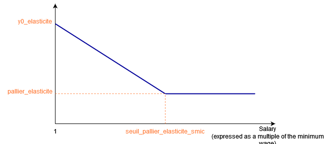

# Methodology underlying the estimation of the effects of reforms on employment

The effect of a reform of payroll tax reductions on employment is estimated applying an elasticity of employment to its cost, both at the individual and company level. In other words, the employment response of employers to a reform is supposed to depend not only on how much the individual labor cost of each contract has changed, but also on how much the firm total labor cost is impacted by the new payroll tax reduction scheme. 

## Modeling of the employment effect of a reform

Let $LC_{s,f,sim}$ denote the simulated labor cost and $LC_{s,f,0}$ the initial labor cost, applicable to the employee $s$ employed in  firm $f$, and $\partial LC_{s,f}$ is the overall percentage change in the labor cost of this group of workers. The labor cost affects the level of employment according to an elasticity $\epsilon^{'}_{w(s)}$ of wage earners $s$ with wage $w(s)$, which is decreasing with the wage level.   
In addition to the individual labor cost, we also consider the effect of the overall percentage change in labor cost within firm $f$ noted $\partial MS_f = \sum_{s \in f} \left( LC_{s,f,sim} - LC_{f,s,0} \right)$ at which employment is assumed to be elastic too (we denote $\mu$ this elasticity, constant with wage). 
Following this approach, the employment effect of a variation in labor cost is written as follows:
$$ Employment \; effect= \sum_f \sum_s \left( \partial LC_{s,f} \times \epsilon^{'}_{w(s)} + \partial MS_f \times \mu \right)$$ 

For example, for a company with a single type of employee who earns wage $w$ and $N(w)$ employees, the formula simply becomes:
$$ Employment \; effect= N(w) \partial LC_{s,f} \times \epsilon^{'}_{w(s)} + N(w) \partial MS_f \times \mu$$ 

## Elasticity function

This elasticity depends only on the individual's gross salary level.

Its form is constrained and is that of a affine function below a certain threshold and a constant function above. It can thus be defined by three parameters:
- `y0_elasticite`, which designates the y-intercept (i.e. the effect on employment of a variation in the cost of labor at the minimum wage);
- `seuil_pallier_elasticite_smic`: the wage level (expressed in multiples of the minimum wage) above which the elasticity of employment to its cost becomes constant;
- `pallier_elasticite`: the level of elasticity once the threshold has been reached.

